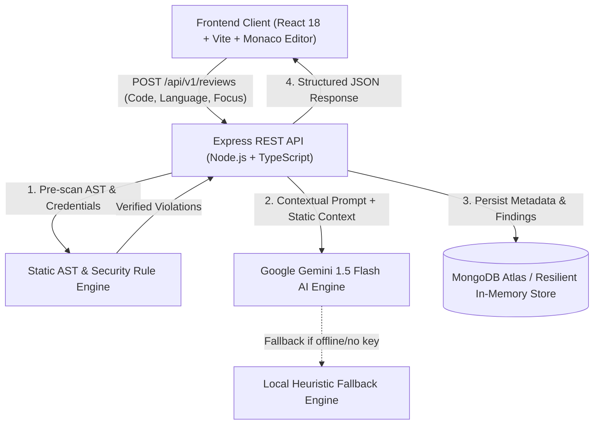

# CodeLens AI — Intelligent Full-Stack Code Review Platform

[](https://nodejs.org/)
[](https://react.dev/)
[](https://www.typescriptlang.org/)
[](https://vitejs.dev/)
[](https://microsoft.github.io/monaco-editor/)
[]()
[]()

> A production-grade full-stack developer tool that unifies **Google Gemini AI reasoning** with **deterministic AST static analysis**, providing automated code audits, security vulnerability scanning, and side-by-side Monaco diff inspection.

---

## 1. Project Overview

CodeLens AI solves the problem of unreliable AI code reviews by introducing a **dual-analysis architecture**:
1. **Deterministic Static Analysis Scanner:** Enforces deterministic security and reliability rules (eval detection, hardcoded credentials, unhandled async promises, DOM XSS, and loose equality) without hallucination risk.
2. **AI Architectural Reasoner (Google Gemini 1.5):** Synthesizes structural feedback, algorithmic optimizations, rubric scores (0–100), root cause analysis, test cases, and a refactored drop-in code fix.
3. **IDE-Grade Monaco Workspace:** Features syntax highlighting, multi-language presets, focus toggles, and side-by-side split diff comparisons powered by the core engine of VS Code.

---

## 2. System Architecture



---

## 3. Technology Stack

### Frontend Application (`frontend/`)
- **Framework & Build:** React 18, Vite, TypeScript
- **Code Editor:** `@monaco-editor/react` (Monaco Editor with side-by-side DiffEditor)
- **Styling:** Custom CSS Design System with dark & light theme tokens (Linear/GitHub-inspired)
- **Routing & Networking:** React Router v7, Axios with JWT request interceptors
- **Icons & UI:** Lucide React, accessible badge systems, custom toast notifications

### Backend Service (`backend/`)
- **Runtime & Server:** Node.js v22, Express, TypeScript (executed via `tsx` and built with `tsc`)
- **AI Integration:** `@google/generative-ai` with structured JSON schema prompt enforcement and offline heuristic fallback
- **Static Analysis:** Deterministic regex & AST pattern evaluator (CVEs, loose equality, silent errors, memory leaks)
- **Database & Storage:** Mongoose (MongoDB Atlas) with an automatic resilient in-memory storage fallback for zero-dependency local execution
- **Security & Validation:** Helmet, CORS, Express Rate Limit, Zod schemas, BCrypt password hashing, JWT authentication
- **Testing:** Native Node.js test runner (`node:test`, `node:assert`, Supertest)

---

## 4. Key Features

- **Split-Screen Code Workspace:** Monaco Editor with syntax highlighting for 11+ languages (JS, TS, Python, Java, Go, Rust, C++, C#, SQL, HTML, CSS).
- **Interactive Preset Scenarios:** 1-click presets demonstrating realistic vulnerabilities (e.g., SQL injection, API secret leak, unhandled async rejection, O(N²) nested loops).
- **Review Focus Modes:** Target reviews on *Comprehensive*, *Security*, *Bugs*, *Performance*, or *Readability*.
- **Quality Score & Weighted Rubric:** 0–100 score with granular sub-scores across Bugs, Security, Performance, and Maintainability.
- **Dedicated Static Analysis Separation:** AI suggestions are explicitly differentiated from deterministic static findings.
- **Side-by-Side Diff Inspector:** Interactive Monaco diff viewer showing line-by-line original versus refactored code with a 1-click clipboard copy action.
- **Privacy-First Code Storage:** Full source code is **never** retained in the database by default (only a safe 4-line snippet and findings are saved). Full persistence is opt-in via User Settings.
- **Live GitHub Repository Explorer:** Connect to open-source or private GitHub repositories, traverse directories, preview files, and load them into the workspace.
- **Analytics Dashboard:** Live metrics calculated directly from stored review history (average quality score, severity breakdown, language distribution, and score trends).
- **Developer Authentication:** Secure JWT registration, login, and demo credential pre-filler for rapid evaluation.

---

## 5. Folder Structure

```
CodeLens-AI/
├── frontend/                   # React + TypeScript Vite Frontend
│   ├── public/                 # Static assets
│   ├── src/
│   │   ├── components/         # Reusable UI components
│   │   │   ├── common/         # Navbar, Footer, Toast notifications
│   │   │   └── workspace/      # MonacoCodeEditor, DiffViewer, ReviewResults
│   │   ├── context/            # AuthContext, ThemeContext, ToastContext
│   │   ├── pages/              # LandingPage, WorkspacePage, DashboardPage,
│   │   │                       # HistoryPage, ReviewDetailPage, GitHubPage, AuthPage, SettingsPage
│   │   ├── services/           # Axios API client & typed endpoints
│   │   ├── types/              # Frontend TypeScript data interfaces
│   │   ├── App.tsx             # Application routing & context providers
│   │   ├── index.css           # Master CSS design system tokens
│   │   └── main.tsx            # React application entrypoint
│   ├── package.json
│   ├── tsconfig.json
│   └── vercel.json             # Vercel SPA routing rewrite config
│
├── backend/                    # Express + TypeScript Backend
│   ├── src/
│   │   ├── config/             # Environment validation and constants
│   │   ├── controllers/        # Auth, Review, Dashboard, GitHub controllers
│   │   ├── middleware/         # Auth, ErrorHandler, RateLimiter middleware
│   │   ├── models/             # Mongoose schemas & In-Memory storage repository
│   │   ├── routes/             # Health, Auth, Review, Dashboard, GitHub routes
│   │   ├── services/           # Gemini AI service, Static analysis, GitHub service
│   │   ├── tests/              # Automated API & analysis test suites
│   │   ├── types/              # Backend TypeScript data interfaces
│   │   ├── validators/         # Zod schemas (ReviewValidator, AuthValidator)
│   │   ├── app.ts              # Express application factory & middleware
│   │   └── server.ts           # Server bootstrap & database lifecycle
│   ├── package.json
│   ├── tsconfig.json
│   └── .env.example
│
├── .gitignore                  # Git exclusions for secrets, dist, and modules
└── README.md                   # Project documentation
```

---

## 6. Installation & Setup

### Prerequisites
- Node.js (v18 or higher recommended; developed on v22)
- npm (v9+)
- *(Optional)* Google Gemini API Key
- *(Optional)* MongoDB URI (Atlas or local)

### Quick Start (Zero Config)

#### 1. Setup & Start Backend
```bash
cd backend
npm install

# Start development server on port 5000
npm run dev
```

*Note:* If `GEMINI_API_KEY` and `MONGODB_URI` are not specified, the backend automatically defaults to the high-fidelity local heuristic review engine and in-memory persistence layer.

#### 2. Setup & Start Frontend
In a separate terminal window:
```bash
cd frontend
npm install

# Start Vite development server on port 5173
npm run dev
```

Open `http://localhost:5173` in your browser.

---

## 7. Environment Configuration

### Backend (`backend/.env`)
```ini
PORT=5000
NODE_ENV=development
FRONTEND_URL=http://localhost:5173

# Optional: Google Gemini API Key
GEMINI_API_KEY=your_gemini_api_key_here

# Optional: MongoDB Connection String
MONGODB_URI=mongodb+srv://<user>:<password>@cluster.mongodb.net/codelens

# JWT Authentication
JWT_SECRET=your_secure_jwt_secret_32_characters_long
JWT_EXPIRES_IN=7d

# Limits
MAX_CODE_CHARS=30000
```

### Frontend (`frontend/.env`)
```ini
VITE_API_URL=http://localhost:5000/api/v1
```

---

## 8. REST API Reference

All routes are versioned under `/api/v1`:

| Method | Endpoint | Description | Auth Required |
|---|---|---|---|
| `GET` | `/api/v1/health` | Health status, DB state, and AI engine indicator | No |
| `POST` | `/api/v1/reviews` | Submit source code for static & AI review | Optional (supports guest) |
| `GET` | `/api/v1/reviews` | List paginated reviews (filters by user if logged in) | Optional |
| `GET` | `/api/v1/reviews/:id` | Fetch detailed report of a review by ID | Optional (checks ownership) |
| `DELETE`| `/api/v1/reviews/:id` | Delete a stored review record | Optional (checks ownership) |
| `GET` | `/api/v1/dashboard/stats` | Aggregated metrics (total reviews, avg score, severities) | Optional |
| `POST` | `/api/v1/auth/register` | Register developer account | No |
| `POST` | `/api/v1/auth/login` | Authenticate and obtain JWT token | No |
| `GET` | `/api/v1/auth/me` | Fetch authenticated user profile | Yes (Bearer Token) |
| `PATCH`| `/api/v1/auth/preferences` | Update user privacy controls (code storage opt-in) | Yes (Bearer Token) |
| `GET` | `/api/v1/github/contents` | Browse files & directories of a repository | No (Optional PAT header) |
| `GET` | `/api/v1/github/file` | Download raw file content for review | No (Optional PAT header) |

---

## 9. Automated Testing

The project includes unit and integration tests covering the static analysis scanner, health endpoints, review generation, validation schemas, and JWT authentication flows.

Run backend tests:
```bash
cd backend
npm test
```

Expected output:
```
✔ should detect eval() execution vulnerabilities
✔ should detect hardcoded credentials and secrets
✔ should detect loose equality operators
✔ should return healthy status code 200 with service metadata
✔ should fail with 400 when code is empty
✔ should successfully review source code and return structured metrics
✔ should register a new user successfully
✔ should log in with registered credentials
✔ should reject login with wrong password
✔ should access /api/v1/auth/me when authenticated
✔ should retrieve aggregated dashboard metrics
# tests 11, pass 11, fail 0
```

Type checks & production builds:
```bash
# Frontend Build Verification
cd frontend && npm run build

# Backend Build Verification
cd backend && npm run build
```

---

## 10. Deployment Guide

### Frontend Deployment (Vercel)
1. Push repository to GitHub.
2. Import project into Vercel and set the **Root Directory** to `frontend`.
3. Set Environment Variable: `VITE_API_URL=https://your-backend.railway.app/api/v1`.
4. Deploy (`vercel.json` ensures client-side routing rewrites are handled).

### Backend Deployment (Render / Railway / Fly.io)
1. Set the **Root Directory** to `backend`.
2. Build Command: `npm install && npm run build`
3. Start Command: `npm start`
4. Set Environment Variables:
   - `NODE_ENV=production`
   - `PORT=5000`
   - `FRONTEND_URL=https://your-frontend.vercel.app`
   - `MONGODB_URI=mongodb+srv://...`
   - `GEMINI_API_KEY=AIzaSy...`
   - `JWT_SECRET=super_secret_32_bytes_random_string`

---

## 11. Security & Privacy Highlights

1. **Deterministic Pre-Scan:** Prevents prompt injection risks and ensures CVEs (eval, secrets, XSS) are flagged reliably.
2. **Zero Code Execution on Server:** Submitted source code is parsed as text and AST tokens; **never** dynamically executed on the application server.
3. **Privacy Opt-In:** Full code retention is turned off by default, saving only a 4-line snippet for identification.
4. **Credential Protection:** Secrets and API keys are strictly configured on the backend; never exposed to frontend bundles.
5. **Rate Limiting & Helmet:** Defends against brute-force authentication attacks and sets hardened HTTP response headers.

---

## 12. Interview & Placement Talking Points

When presenting this project during technical interviews:
- **Architectural Trade-offs:** Explain why you separated deterministic static analysis from LLM heuristics (eliminating hallucinations for known security anti-patterns while leveraging AI for architectural context).
- **Resilient Fallback Design:** Discuss the repository pattern in `db.ts` and `geminiService.ts` that enables the app to run seamlessly in zero-dependency local environments while being 100% production-ready for MongoDB Atlas and Gemini API.
- **Frontend Performance:** Highlight the use of Monaco Editor with lazy model disposal, responsive CSS tokens, and clean React context state management without unnecessary heavy third-party state libraries.
- **RESTful API Versioning:** Walk through the `/api/v1` route design, centralized error middleware, and Zod input validation boundaries.
